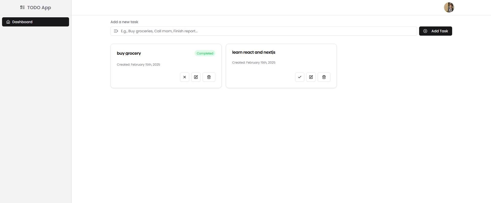

# To-Do Application

A simple and intuitive To-Do application to manage tasks efficiently.

## Features

- Add, edit, and delete tasks
- Mark tasks as completed
- Persistent storage
- Responsive design

## Screenshots

### Login Page


### Home Page



### Edit Task


### Delete Task


## Installation

1. Clone the repository:
   ```sh
   git clone https://github.com/prodanish203/todo-app-next.git
   ```
2. Navigate to the project directory:
   ```sh
   cd todo-app
   ```
3. Install dependencies:
   ```sh
   pnpm install
   ```
4. Start the application (Dev Mode):
   ```sh
   pnpm dev
   ```

## Technologies Used

- NextJs
- Prisma ORM
- Postgresql (Database)
- NextAuth
- Google OAuth
